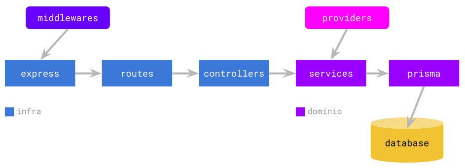

# APM Node

Aplicação modelo para uma API-REST em NodeJS, implementando autenticação via JWT.

## Tecnologias utilizadas

- [ExpressJS](https://expressjs.com/)
- [Prisma ORM](https://www.prisma.io/)
- Banco de dados [PostgreSQL](https://www.postgresql.org/) (mas pode usar qualquer um suportado pelo Prisma)

## Modelo arquitetural

## Use cases implementados nesse template

- Create user
- List users
- Get user
- Update user
- Delete user
- Login
- Refresh token
